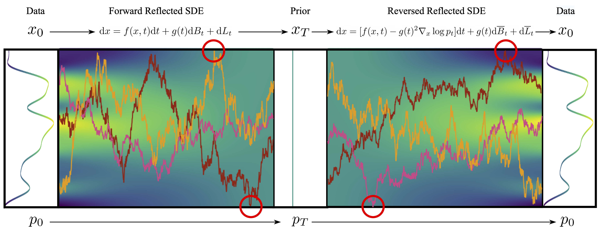
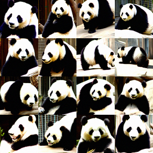
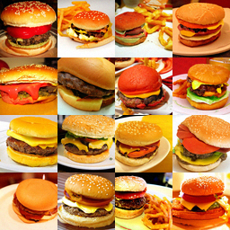
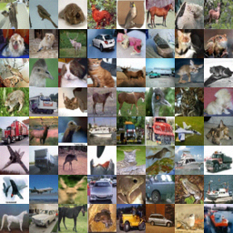

# Reflected Diffusion Models
[](LICENSE)
[](https://arxiv.org/abs/2304.04740)
[](https://aaronlou.com/blog/2023/reflected-diffusion/)
[](https://twitter.com/aaron_lou/status/1646528998594482176?s=20)
[](https://news.ycombinator.com/item?id=35863309)
[](https://www.youtube.com/watch?v=YfneSNXJSLE&ab_channel=Valence)

[](https://paperswithcode.com/sota/image-generation-on-cifar-10?p=reflected-diffusion-models)
[](https://paperswithcode.com/sota/image-generation-on-imagenet-32x32?p=reflected-diffusion-models)

This repo contains a PyTorch implementation for the paper [Reflected Diffusion Models](https://arxiv.org/abs/2304.04740) by [Aaron Lou](https://aaronlou.com) and [Stefano Ermon](https://cs.stanford.edu/~ermon/), appearing at ICML 2023.



## Setup

Requisite packages can be installed directly from the `requirements.txt` (note that this installs pytorch 2.0.1 with CUDA 11.7 enabled, but this can be downgraded based off of your requirements):
```
pip install -r requirements.txt
```
One can also manually install the packages `torch`, `torchvision`, `scipy`, `hydra-core`, and `hydra-submitit-launcher` through `pip`.

## Working with Pretrained Models

### Download Models

To download the pretrained models, simply run
```
sh download_pretrained.sh
```
This creates a `weights` folder with various model weights for CIFAR10 and ImageNet64. Each (main) model directory is of the form
```
├── model_directory
│   ├── .hydra
│   │   ├── config.yaml
│   ├── checkpoints
│   │   ├── checkpoint_*.pth
```
which is the minimum file structure that is needed for visualization and is generated by our training script.

### Run Visualization

We can visualize samples using
```
python run_vis.py load_dir=model_directory
```
where `model_directory` is a model directory as given above such as `weights/cifar10` or `weights/imagenet64`. This creates a new directory `direc=vis/DATE/TIME` which outputs the images in the following directory structure
```
├── direc
│   ├── images
│   │   ├── *.png
│   │   ├── *.npz
```
Arguments can be added with `ARG_NAME=ARG_VALUE`. Interesting ones include
```
label              imagenet class label (used with imagenet64 classifier-free guided model)
w                  guidance weight (used with imagenet64 classifier-free guided model)
sampling
    method         "pc" or "ode"
eval
    rounds         number of images to generate
    batch_size     batch size of generated images
```
For more information on imagenet class lables, reference this [document](https://deeplearning.cms.waikato.ac.nz/user-guide/class-maps/IMAGENET/). As an example, to generate 4 rounds of 16 images of pandas with guidance weight 2.5 using the ode, simply run
```
python run_vis.py load_dir=weights/imagenet64 label=388 w=2.5 sampling.method=ode eval.batch_size=16
```
Changing these hyperparameters results in outputs like the following:

  

## Training New Models

### Downloading Data

To download the datasets used in the paper, simply run `cd dataset` and run the corresponding command:
```
python download_cifar10.py
sh download_imagenet32.sh
python compile_imagenet64.py /path/to/imagenet/
```
One can also add in new datasets by modifying the `datasets.py` file directly.

### Run Training

We can run training using the command
```
python run_train.py
```
This creates a new directory `direc=runs/DATE/TIME` with the following structure (compatible with running visualizations)
```
├── direc
│   ├── .hydra
│   │   ├── config.yaml
│   │   ├── ...
│   ├── checkpoints
│   │   ├── checkpoint_*.pth
│   ├── checkpoints-meta
│   │   ├── checkpoint.pth
│   ├── samples
│   │   ├── iter_*
│   │   │   ├── sample_*.png
│   │   │   ├── sample_*.npy
│   ├── logs
```
Here, `checkpoints-meta` is used for reloading the run following interruptions, `samples` contains generated images as the run progresses, and `logs` contains the run output. Arguments can be added with `ARG_NAME=ARG_VALUE`, with important ones being:
```
ngpus                  the number of gpus to use in training (using pytorch DDP)
model                  one of ddpmpp, vdm, adm, where adm is used with imagenet64c and ddpmpp and vdm are used otherwise.
    *                  various args for the model
data                   one of cifar10, imagenet32, imagenet64c.
    *                  various args for the data
training
    batch_size         training batch size
    n_iters            number of gradient updates
    drop_label         percentage of labels dropped during training (when using adm and imagenet64c)
sde
    sigma_min          minimum sde noise level. 0.01 is used for image generation while 0.0001 is used for likelihood results
optim
    lr                 learning rate of the optimizer
```
The commands used for CIFAR10 image generation, CIFAR10 likelihood, ImageNet32 likelihood, and ImageNet64 image generation are respectively given below (on a 80GB gpu):
```
python train.py data=cifar10 model=ddpmpp
python train.py ngpus=4 data=cifar10 data.random_flip=False model=vdm training.n_iters=10000001 sde.sigma_min=0.0001
python train.py ngpus=8 data=imagenet32 model=vdm training.n_iters=2000001 training.batch_size=512 sde.sigma_min=0.0001
python train.py ngpus=8 data=imagenet64c model=adm training.n_iters=400001 training.batch_size=2048 optim.lr=1e-4
```

## Other Features

### SLURM compatibility

To run on slurm, simply uncomment the last few lines of `configs/train.yaml` or `configs/vis.yaml` and fill in your cluster details in place of `null`. Then, run the corresponding train/visualization commands with -m, e.g.
```
python run_train.py -m
```

## Citation
```
@inproceedings{lou2023reflected,
  title={Reflected Diffusion Models},
  author={Aaron Lou and Stefano Ermon},
  booktitle={International Conference on Machine Learning},
  year={2023},
  organization={PMLR}
}
```
## Acknowledgements

This repository builds heavily off of [score sde](https://github.com/yang-song/score_sde_pytorch) and [edm](https://github.com/NVlabs/edm).